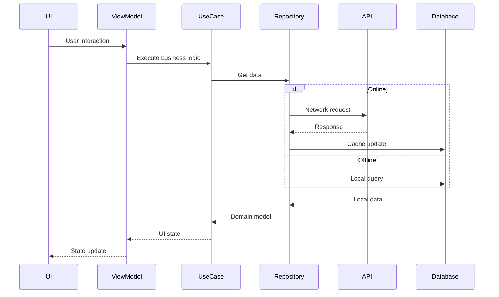

# Ultimate Delivery App - Onyx

## 📱 Project Overview
A delivery tracking application for Android built with modern Jetpack Compose following Clean Architecture principles. The app features:
- Authentication flow
- Bills management with local caching
- Bilingual support (English/Arabic)
- Session timeout handling
- Responsive UI with Material 3 theming

## 🏗️ Architecture

### Clean Architecture Layers
```
📦 com.ultimate.ordersdelivery
├── 📂 data
│   ├── 📂 local
│   │   ├── 📜 AppDatabase.kt
│   │   ├── 📂 dao
│   │   │   ├── 📜 DeliveryBillDao.kt
│   │   │   └── 📜 StatusTypeDao.kt
│   │   │
│   │   └── 📂 entity
│   │   │   ├── 📜 DeliveryBillEntity.kt
│   │   │   └── 📜 StatusTypeEntity.kt
│   │   │
│   ├── 📂 remote
│   │   ├── 📜 ApiService.kt
│   │   └── 📂 deliveryBills
│   │   │   ├── 📜 DeliveryBillsRequest.kt
│   │   │   └── 📜 DeliveryBillsResponse.kt
│   │   └── 📂 login
│   │   │   ├── 📜 LoginRequest.kt
│   │   │   └── 📜 LoginResponse.kt
│   │   └── 📂 status
│   │   │   ├── 📜 StatusTypesRequest.kt
│   │   │   └── 📜 StatusTypeEntity.kt
│   │   │
│   │   └── 📜 OperationResult.kt
│   │   │
│   ├── 📂 repository
│   │   ├── 📜 AuthRepositoryImpl.kt
│   │   └── 📜 DeliveryBillsRepositoryImpl.kt
├── 📂 di
│   ├── 📜 AppModule.kt
│   └── 📜 App.kt
├── 📂 domain
│   └── 📂 repository
│       ├── 📜 AuthRepository.kt
│       └── 📜 DeliveryBillsRepository.kt
├── 📂 presentation
│   ├── 📂 auth
│   │   ├── 📜 LoginScreen.kt
│   │   ├── 📜 LoginScreenState.kt
│   │   └── 📜 LoginViewModel.kt
│   ├── 📂 home
│   │   ├── 📜 HomeScreen.kt
│   │   ├── 📜 HomeViewModel.kt
│   │   └── 📜 BillsState.kt
│   ├── 📂 splash
│   │   └── 📜 SplashScreen.kt
│   ├── 📂 language
│   │   ├── 📜 LanguageViewModel.kt
│   │   └── 📜 LanguageDialog.kt
│   ├── 📂 navigation
│   │   ├── 📜 AppNavigation.kt
│   │   └── 📜 Screens.kt
│   └── 📂 components
│       ├── 📜 DialogComponents.kt
│       ├── 📜 TabsComponent.kt
│       └── 📜 EditTextComponents.kt
├── 📂 utils
│   ├── 📜 SessionManager.kt
│   ├── 📜 SessionHandler.kt
│   ├── 📜 Preferences.kt
│   └── 📜 Constants.kt
└── 📜 MainActivity.kt
```

## 🧠 Key Design Decisions

### 1. Reactive UI with Compose
- **Why**: Modern declarative UI framework with better performance
- **Implementation**:
  - State hoisting for all UI components
  - ViewModels expose `StateFlow` for Compose observation
  - Custom theming with Material 3 dynamic colors

### 2. Offline-First Data Strategy
- **Why**: Ensure functionality without network
- **Implementation**:
  ```kotlin
  override suspend fun getDeliveryBills(): List<Bill> {
      return try {
          val remote = api.getBills()
          if (remote.success) {
              dao.insertBills(remote.data) // Cache
              remote.data
          } else {
              dao.getBills() // Fallback
          }
      } catch (e: Exception) {
          dao.getBills() // Fallback
      }
  }
  ```

### 3. Session Management
- **Why**: Security requirement
- **Implementation**:
  - Activity-level touch tracking
  - Background timeout handler
  ```kotlin
  @Singleton
  class SessionManager @Inject constructor(...) {
      private val timeout = 120_000L // 2 mins
      
      fun checkSession() {
          if (inactiveTime > timeout) logout()
      }
  }
  ```

### 4. Internationalization
- **Why**: Middle East market requirement
- **Implementation**:
  - Complete RTL layout support
  - Bilingual string resources
  ```xml
  <!-- values/strings.xml -->
  <string name="welcome">Welcome</string>
  
  <!-- values-ar/strings.xml -->
  <string name="welcome">مرحباً</string>
  ```

## 🛠️ Technical Stack

| Component          | Technology           | Purpose                          |
|--------------------|----------------------|----------------------------------|
| UI Framework       | Jetpack Compose      | Modern declarative UI            |
| DI                 | Hilt                 | Dependency injection             |
| Networking         | Retrofit             | API communication                |
| Local Storage      | Room                 | Offline data persistence         |
| Async              | Coroutines           | Background operations            |
| Navigation         | Compose Navigation   | Screen transitions               |


## 🔄 Data Flow


## ♻️ Lifecycle Management
- **ViewModels**: Survive configuration changes
- **Coroutines**: Lifecycle-aware scopes
  ```kotlin
  viewModelScope.launch {
      // Cancelled automatically when VM clears
  }
  ```


## 📐 UI Guidelines

### Component Design Principles
1. **Reusability**: All components accept Modifier parameter
   ```kotlin
   @Composable
   fun BillCard(
       modifier: Modifier = Modifier,
       order: Order
   ) { ... }
   ```

2. **State Hoisting**:
   ```kotlin
   var text by remember { mutableStateOf("") }
   OutlinedTextField(
       value = text,
       onValueChange = { text = it }
   )
   ```

3. **Theming**: Custom design system
   ```kotlin
   MaterialTheme(
       colorScheme = lightColorScheme(
           primary = Purple40,
           secondary = PurpleGrey40
       ),
       typography = CustomTypography
   ) { Content() }
   ```

## 🔒 Security Measures
- **Session Timeout**: 2 minute inactivity logout
- **Data Storage**: Encrypted SharedPreferences for tokens
- **Network**: HTTPS with certificate pinning

## 🚀 Getting Started

### Prerequisites
- Android Studio Giraffe+
- Kotlin 1.9.0
- JDK 17

### Setup
1. Clone repo
2. Run project on Android Studio

### Build Variants
| Variant  | Description                  |
|----------|------------------------------|
| debug    | Development builds (logging) |
| release  | Proguard optimized           |

## 📚 Documentation
- [Compose Guidelines](https://developer.android.com/jetpack/compose)
- [Hilt Documentation](https://dagger.dev/hilt/)
- [Room DB Guide](https://developer.android.com/training/data-storage/room)

## $\color{blue}{Authors}$

- [@Mahmoudadel17](https://www.github.com/Mahmoudadel17)
